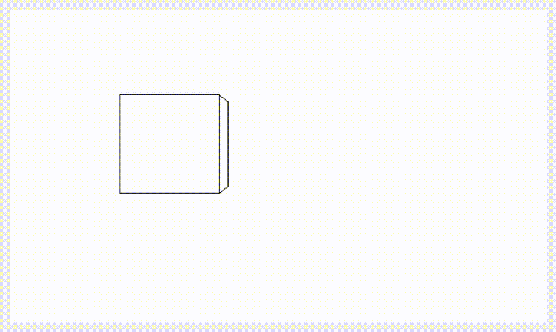

2D Stealth Game Engine

I made a 2D stealth game engine in C++ using [SFML](https://www.sfml-dev.org/). Why? Because there should be a Hitman + Mark of the Ninja stealth game in 2D Top-down and somebody should get started on it.
 Sooraj

*	[Blog](https://nomarkeu.github.io/sneakattack/)

*	[Github repository](https://github.com/nomarkeu/sneakattack)

Resistor colorcode viewer (C++ + Qt)

Mini FPS with a cube as environment (C++ + Qt)

